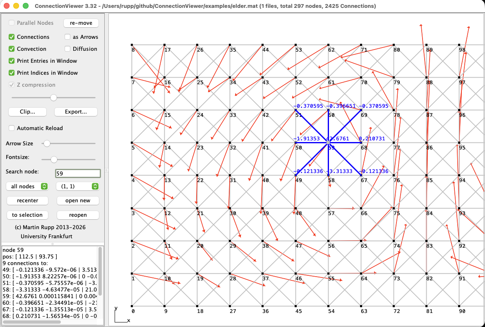
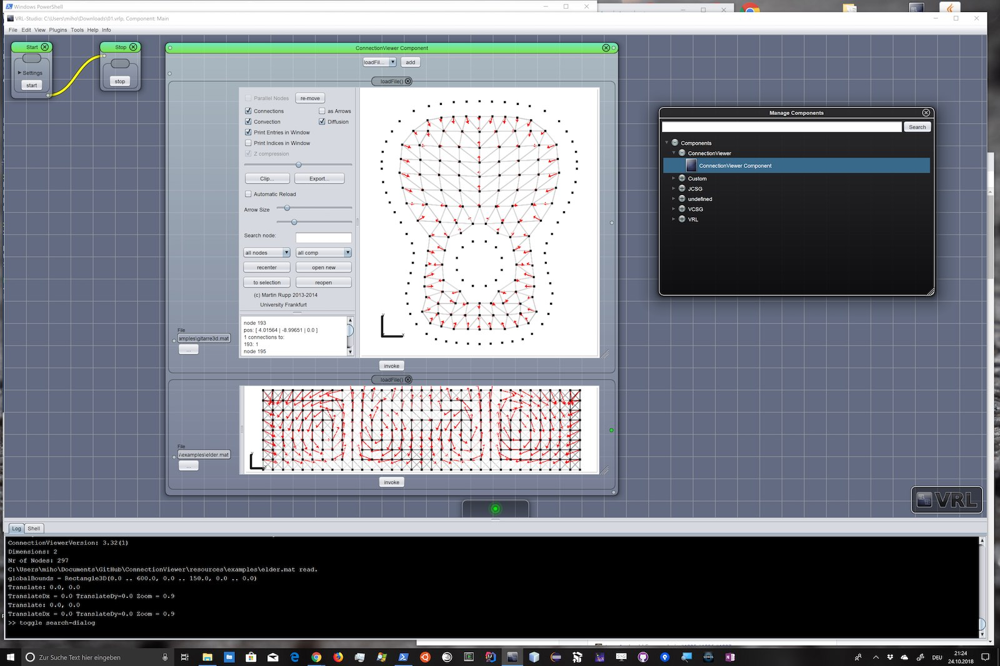

ConnectionViewer
===============================
ConnectionViewer uses a very simple ASCII file format for Coordinates, Matrices and Vectors, which is implementable in every programming language in a couple of minutes. It is documented in [FORMAT.md](FORMAT.md).

## Running ConnectionViewer

	java -jar build/libs/ConnectionViewer.jar
	java -jar build/libs/ConnectionViewer.jar resources/examples/bodensee.mat

Or via Gradle, without building a jar first:

	./gradlew run --args="resources/examples/bodensee.mat"

Started without a file, the app opens an empty window; use **open new** to load a
matrix. The full list of command line options is in the header comment of
`ConnectionViewer.java`, for example, to export a PDF of the Bodensee example:

	java -jar build/libs/ConnectionViewer.jar resources/examples/bodensee.mat -width 950 -height 700 -exportPDF out.pdf -quit

## ConnectionViewer as VRL-Plugin

ConnectionViewer provides a [VRL-Studio](https://mihosoft.eu) plugin that can be used to visualize ConnectionViewer as reflection-based component in a .vrlp-project. Additionally, the full UI is availiable from the tool menu.

## Building ConnectionViewer

See [BUILDING.md](BUILDING.md) for details. In short:

### Requirements

- JDK >= 21
- Internet connection (Gradle and the dependencies are downloaded automatically;
  `settings.gradle.kts` will even fetch a matching JDK if the one on your `PATH`
  is a different version)
- IDE: [Gradle](http://www.gradle.org/) Plugin (not necessary for command line usage)

### Command Line

Navigate to the `ConnectionViewer` core [Gradle](http://www.gradle.org/) project
(i.e., `path/to/ConnectionViewer`) and enter the following command

#### Bash (Linux/macOS/Cygwin/other Unix shell)

    ./gradlew macApp          # build/jpackage/ConnectionViewer.app (macOS only)
    ./gradlew macDmg          # build/distributions/ConnectionViewer-<version>.dmg (macOS only)
    ./gradlew fatJar          # standalone app, without VRL
    ./gradlew run             # compile and launch the GUI
    ./gradlew vrlPlugin       # VRL plugin jar

#### Windows (CMD)

    gradlew fatJar

### IDE

Open the `ConnectionViewer` core [Gradle](http://www.gradle.org/) project in your
favourite IDE and build it by calling the `fatJar` task (`assemble` also works and
depends on it).

### Install VRL-Studio plugin via Gradle

To install ConnectionViewer as [VRL-Studio](https://vrl-studio.mihosoft.eu/) plugin via gradle, call the `installVRLPlugin` task and (re)start VRL-Studio.

It installs into `~/.vrl/<VRL major version>/default/plugin-updates`. Use a
different location with:

    ./gradlew installVRLPlugin -PvrlDir=/path/to/vrl/config

### macOS application bundle

    ./gradlew macApp     # build/jpackage/ConnectionViewer.app       (~45 MB)
    ./gradlew macDmg     # build/distributions/ConnectionViewer-3.4.dmg (~30 MB)

Both embed a Java runtime, so they also run on a Mac without a JDK installed;
that runtime is what accounts for nearly all of the size. Use `macDmg` for
distribution — the disk image is compressed, roughly a third smaller than the
`.app` directory.

They register the `.mat`, `.pmat`, `.vec`, `.pvec` and `.tarmat` file types, so
those can be opened from Finder. The bundle is unsigned; on another machine
Gatekeeper blocks it until you right-click and choose *Open*.

# Some documentation:

- Connections: Turning this on/off will display / not display the connections between nodes in the window. sometimes displaying a lot of connections can be slow.

- Connections   as arrows: will display the connections as arrows. slower, but sometimes more clear than the normal way (since these are "directed")

- Diffusion: Will color the connections depending on the ruge/stueben strength of connection. i.e. you can see anisotropic diffusion in one direction.

- Convection: Will show an arrow pointing into the direction of "algebraic convection". That is: if you have a connection -1.9 to left, +2 to mid, and -0.1 to right, convection is to headed to the left.

- Parallel Nodes: enabling this will color each file from a pmat file differently.

- re-move: when using pmat files, you can move the nodes of one processor by holding shift, clicking the mouse and move it around. re-move will move all nodes in the original position.

- Clip: Will open up a window so you can clip some axes (X, Y, Z clipping). Useful especially in 3d.

- Export: Export the current view to PDF or tex (as tikzpicture). See galery.

- open new: Open a matrix file. If a file is already loaded it is opened in a new window, otherwise it is loaded into the current one.

- reopen: Reopen the current file. Automatic reload: automatic reload if file changes.

- Arrow Size, Font Size: Change arrow/font size.

- all nodes / N1 / N2: display all nodes or neighborhood 1 / 2 / 3 etc. of the currently selected node(s). useful in 3d.

- all comp: show different components.

- recenter: recenter the loaded file.

- Search node: enter a node you want to see. This node is selected then. Use 2.234 to select node 234 from parallel file 2. Use to selection to zoom to the selected node.
